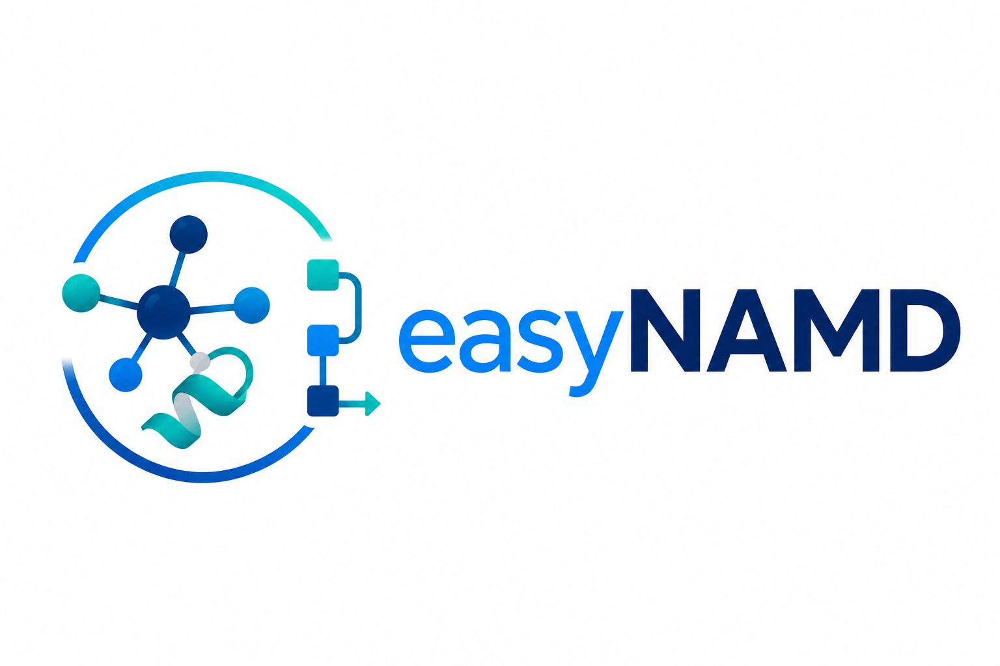

# easyNAMD



GUI for preparing molecular dynamics systems in VMD for subsequent simulation in NAMD.

A Python tool designed to simplify work with VMD/NAMD. Its main features include preparing data for creating .psf/.pdb files and generating configuration files.
This tool is in the early stages of development. Please do not use this product for commercial purposes without the author's personal permission.

## Current features

### Prepare PDB tab

Clean up a raw PDB before building:

- Group atoms into protein chains, ligands/cofactors, metal ions and water; keep or drop each group.
- Interactive 3D viewer (3Dmol.js in a persistent window): protein as cartoon, het groups as VDW spheres; toggle groups live.
- Alternative locations (altLoc): pick which conformer to keep per residue, or a global default; focus a residue in 3D.
- Assign a chain id to each group independently.
- Atoms are renumbered from 1 on save.
- Export a ligand to `.mol2` (via Open Babel).
- On save, hand the cleaned PDB straight to the Build tab.

### Build tab (step-by-step)

1. **Build PSF** — build PSF/PDB from a local `.pdb` using `psfgen`:
   - per-chain N/C terminus patches, histidine protonation (HSD/HSE/HSP) with an RDKit-rendered legend and a 3D view of each histidine's environment,
   - disulfide bonds auto-detected from `SSBOND`, plus free-form custom patches,
   - hetero segments: build ligands / cofactors / ions as their own psfgen segments (merged automatically),
   - parameter coverage check (warns about residues missing from the loaded topologies),
   - warnings for ALTLOC, insertion codes, missing residues (REMARK 465), missing atoms (REMARK 470) and chain gaps,
   - `guesscoord` / `regenerate` options.
2. **Solvate** — TIP3P water box with a given padding; optional rotate-to-minimize-volume and move-center-of-mass-to-origin.
3. **Ionize** — neutralize the system, optionally at a set salt concentration, with a choice of cation (Na/K/Ca/Mg/Cs) and anion (Cl).

Generates a Tcl script (previewable before running) and runs VMD headlessly with the log streamed live; the psfgen log is scanned for problems. After the build the total charge and atom count are reported, and periodic cell vectors are written to `cell.txt` for the NAMD config.

Extras: a **Summary** of the system before building, and **Save/Load preset** to store and reuse all build settings as JSON.

### Simulate tab (NAMD package generator)

Generate server-ready NAMD inputs for conventional MD:

- Pipeline of enabled/disabled stages, one `.conf` per stage.
- Built-in template library: standard minimization → optional heating → restrained/free equilibration → production, quick smoke test, cautious equilibration, production-only restart and chunked production.
- Best-practice CHARMM36 explicit-water defaults with editable MD hyperparameters: timestep, temperature, pressure, heating ramp start/end/increment/frequency, PME grid spacing, cutoff/switch/pairlist distances, Langevin damping, Langevin piston, output/restart/DCD frequencies and positional-restraint force constants.
- Advanced MD settings expose integrator, nonbonded, PME, thermostat/barostat, wrapping/output and NAMD3 GPU-resident controls including `CUDASOAintegrate auto/on/off`.
- Pressure control is stored per stage: soluble `NPT` uses isotropic pressure coupling, membrane `NPT` uses semi-isotropic flexible-cell coupling, `NPAT` uses constant area and `NPgT` uses surface-tension coupling.
- Membrane system mode adds `NPAT` and `NPgT` stage ensembles, semi-isotropic membrane NPT defaults, `surfaceTensionTarget`, and membrane-specific pipeline templates.
- Duration helpers: stage length can be edited as steps, ps or ns; long stages can be split into restart-chained chunks.
- Automatic chaining via previous stage restart files (`.restart.coor/.vel/.xsc`), plus restart/continue mode from an external restart prefix.
- Any stage can override the automatic chain with its own input restart files (`restart files` in the stage table). Pick the `.coor`, `.vel` and `.xsc` files through the file dialog; easyNAMD will copy them and use them for that stage instead of the previous stage output.
- Full package preview, timeline summary and pre-flight validation with errors and warnings.
- Full Simulate project save/load, system composition analysis, restart triplet inspection, config linting and live protocol/report summary.
- Preflight checks catch PSF/PDB atom-count mismatches, empty parameter/restart files, incomplete cell vectors and restraint-reference atom-count mismatches before package generation.
- Generated packages include provenance in both `protocol.md` and `namd_config_summary.json`: UTC timestamp, git commit, dirty-tree flag, platform and Python version.
- Package inspection records copied inputs, per-stage restart chaining, pressure mode, `CUDASOAintegrate` value and whether constraints are actually enabled.
- Positional-restraint force constants can be set per stage; automated restraint-PDB generation and restraint schedules are intentionally kept out of the GUI until that workflow is redesigned.
- Export package layout with `conf/`, `system/`, `output/`, `templates/`, `namd_config_summary.json`, `protocol.md` and `README_run.txt`.
- The package focuses on config construction and stage orchestration. It does not generate `run.sh` or SLURM scripts; GPU visibility, CPU counts, modules and extra NAMD flags are intentionally left to the command or batch script used on the target machine.
- GPU-resident NAMD3 defaults: `CUDASOAintegrate auto` writes `off` for minimization and `on` for MD stages. Set it to `off` for CPU-only runs.
- After a successful Build run, the generated system can be handed directly to Simulate for NAMD package generation.

## Dependencies

- [VMD](https://www.ks.uiuc.edu/Research/vmd/) (configured on first launch)
- [NAMD](https://www.ks.uiuc.edu/Research/namd/) on the machine where generated configs will be run
- [Open Babel](https://openbabel.org/) (`obabel`, for ligand → mol2)
- Python 3.11+
- [uv](https://github.com/astral-sh/uv)

Python packages (installed via `uv`): customtkinter, pywebview, py3Dmol, pillow, rdkit.

## Usage

```bash
uv run python main.py
```

On first launch the app will attempt to detect VMD automatically. The path can be changed in the **Settings** tab.

## NAMD workflow

1. Build the system in the **Build** tab. After VMD finishes, easyNAMD writes the final `.psf`, `.pdb` and `*_cell.txt` files.
2. Open **Simulate** or accept the handoff prompt after a successful build.
3. Choose a pipeline template, tune stages and global MD settings, then run **Validate**.
4. Use **Preview package** to inspect every generated `.conf`.
5. Run **Generate NAMD package** and copy the generated package folder to the server.

The generated package is self-contained for server execution and includes a reproducibility summary:

```
namd/
  conf/                  # one NAMD .conf per enabled/expanded stage
  system/                # copied psf/pdb/cell/parameter/restart inputs
  output/                # NAMD restart, trajectory and xst outputs
  templates/pipeline.json
  namd_config_summary.json  # system, pipeline, provenance, inspection and warnings
  protocol.md               # human-readable simulation protocol with provenance
  README_run.txt
```

Long MD stages can be split into restart-chained chunks. For continuation runs, set **Start** to `restart` and point `restart prefix` at files like `stage.restart.coor`, `stage.restart.vel` and `stage.restart.xsc` without the final extension.

For membrane systems, set **System type** to `membrane` or apply a membrane template. Pressure coupling is represented explicitly for each stage before config generation: `NPAT` stages write `useConstantArea on`; membrane `NPT` stages use flexible-cell semi-isotropic pressure control; `NPgT` stages write `surfaceTensionTarget` for surface-tension equilibration/production.

`CUDASOAintegrate auto` writes `off` for minimization stages and `on` for MD stages. On GPU servers, select the actual GPU device outside easyNAMD with the local launch command or scheduler wrapper, for example through `CUDA_VISIBLE_DEVICES` or NAMD's `+devices` options. For CPU-only runs, set `CUDASOAintegrate` to `off`.

## Force fields

CHARMM36 topology and parameter files are stored in:

```
topologies/          # .rtf, .str — protein, water, lipids, nucleic acids
└── ligands/         # ligand topologies

parameters/          # .prm, .str
└── ligands/         # ligand parameters
```

Ligand files (from CGenFF or equivalent) are loaded via the **Add** buttons on the Build PSF tab.

## Project structure

```
main.py
gui/
  app.py             # main window, tabs, Prepare → Build handoff
  prepare_panel.py   # Prepare PDB tab (groups, chains, altLoc, mol2)
  build_panel.py     # step-by-step build tabs
  simulate_panel.py  # NAMD pipeline/package generator
  namd_stage_row.py  # editable stage row widget used by Simulate
  webview_window.py  # standalone pywebview process for the 3D viewer
core/
  pdb_parser.py      # PDB parsing (chains, SS bonds, HIS, hetero, missing res/atoms, gaps)
  molecule_groups.py # group splitting, chain/altLoc-aware saving
  coverage.py        # topology parameter-coverage check
  viewer_html.py     # 3Dmol.js page generation
  his_images.py      # RDKit-rendered HSD/HSE/HSP legend
  mol2.py            # PDB → mol2 via Open Babel
  namd/              # NAMD stages, validation, inspection, protocol and .conf writer
    tools.py         # system analyzer, restart inspector, restraint PDB writer and config lint
  tcl_writer.py      # Tcl generation (psfgen, hetero segments, solvate, autoionize, cell, charge, recenter)
  vmd_runner.py      # VMD execution via subprocess
topologies/
parameters/
```
